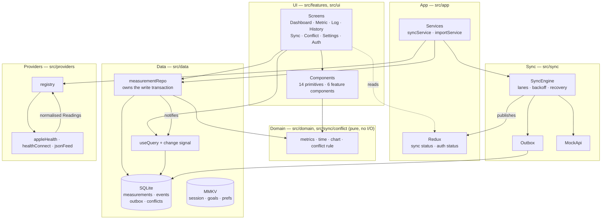
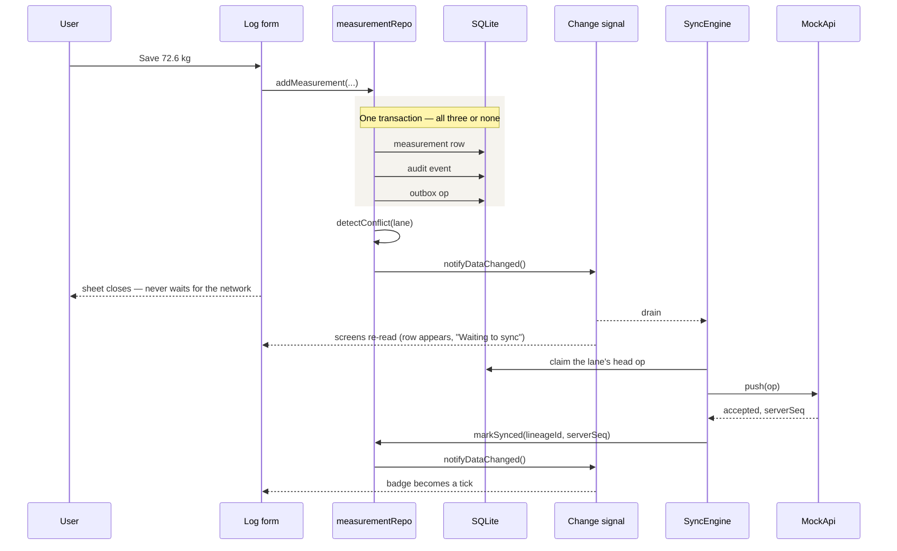

# Baseline — Architecture & Engineering Notes

The detailed version. [README.md](README.md) covers what the app does, how to
run it, and what is built. This page does not repeat any of it — it covers only
the reasoning: why each choice was made, what was measured, and what was
rejected.

React Native 0.87.1 · React 19.2.3 · TypeScript · 438 tests

---

## Contents

- [Architecture](#architecture)
- [Key technical decisions](#key-technical-decisions)
- [State management](#state-management)
- [Local persistence](#local-persistence)
- [Health data integration](#health-data-integration)
- [Offline and synchronisation](#offline-and-synchronisation)
- [Conflict resolution](#conflict-resolution)
- [Testing](#testing)
- [Performance](#performance)
- [Trade-offs](#trade-offs)
- [AI usage](#ai-usage)

---

## Architecture

Four layers, and the dependency arrow only points one way.



The domain layer imports nothing from the others, which is what lets the rules
be tested without a device — op-sqlite and MMKV are native modules and cannot
load under Jest.

### What happens when you save a reading



### Directory map

```
src/
  domain/      metrics, time, chart, units — pure rules, no I/O
  data/        SQLite schema, migrations, repository, useQuery, prefs
  sync/        outbox, engine, conflict rule, mock API
  providers/   registry + one adapter per health source
  app/         navigation, Redux store, services, error boundary
  features/    one folder per screen, plus components/ shared between them
  ui/          15 presentational primitives and the design tokens
  types/       ambient declarations
  test/        the development seed
```

---

## Key technical decisions

**SQLite through op-sqlite, with SQL written by hand and no ORM.** This app's
speed comes down to its indexes and how each query runs. Writing the SQL myself
means I can read exactly what runs, and check it with `EXPLAIN QUERY PLAN`. An
ORM would add a dependency and put a layer between me and the thing I need to
measure.

**Risky SQL is built in one file and run in another.** `bucketSql.ts` and
`importSql.ts` hold statements that fail quietly rather than loudly. A timezone
offset with the wrong sign. An `AVG` where a `SUM` belongs. A bare column beside
`MAX()` that stops being defined. An upsert that misses its index. Each returns
a believable wrong answer. These files import nothing native, so they can be
unit-tested. The rest of the SQL sits inline in the repository, where it is
easier to follow.

**No charting library.** Victory Native brings in Skia to draw what is a couple
of hundred lines of SVG. The maths that turns readings into coordinates lives in
`domain/chart.ts` as a pure function with 32 tests. That is worth more than the
drawing it feeds.

**The fake server is a plain class, not MSW.** Tests need to control delay,
failure rate and lost replies exactly. A seeded random number generator in the
constructor does that. A service worker does not. The same seed gives the same
failures on every run.

**Bare React Native rather than Expo.** This app leans on native libraries:
SQLite, MMKV, NetInfo. Those are the ones Expo's managed workflow makes harder,
not easier.

---

## State management

Redux Toolkit holds **screen state only**: sync status, who is signed in, units
and goals. Readings never go into the store.

That boundary matters. The database is the one source of truth. Put a copy in
Redux and the same fact lives in two places, which then have to be kept in step.
Screens read through `useQuery`, a small hook that runs one query and tracks its
own loading, error and read-time.

Writes and reads are joined by a **change signal**
([`src/data/changes.ts`](src/data/changes.ts)). The repository announces every
write, and each reader asks its own question again. Notifications are grouped
over 50 ms, so syncing six changes causes one reload, not six.

**Each card runs its own query.** The dashboard runs five, each stamped with
when it was read. If one metric is slow or fails, that card says so. The other
four carry on.

The sync engine pushes its state into Redux through an `onChange` callback.
Screens read the store. They never call the engine directly. So a screen cannot
start a second send, or change the queue behind the engine's back.

---

## Local persistence

**SQLite** for anything that is a measurement, **MMKV** for anything that is a
setting.

| Table | Holds |
| --- | --- |
| `measurements` | current readings |
| `measurement_events` | append-only audit log — what happened, in order |
| `outbox` | uploads that have not yet succeeded |
| `conflicts` | lanes needing a decision |

MMKV holds the cached session, the goals, the connected sources, the selected
metrics and the display units. Goals in particular are settings, not
measurements: changing one never rewrites history, it only changes what progress
is measured against.

**Units are a lens, not a column.** Weight is always stored in kilograms, water
in millilitres, sleep in minutes; choosing pounds converts on the way out and
back on the way in. Converting on write would make the stored number depend on a
setting that can change afterwards, with nothing on the row to say which setting
was in force when it was written. The bounds travel with the unit rather than
the metric, because 30 is a reasonable number of kilograms and an impossible
number of pounds.

### Three time fields, each with one job

```
recordedAt   phone clock — what the reading is about. Displayed. Never orders anything.
serverSeq    assigned by the server on acceptance. The ordering authority.
localSeq     local monotonic counter. Orders rows the server has not seen; they
             always sort after rows it has.
```

Two phones editing the same reading offline will both claim a time. Only the
server can break that tie. So the server's sequence decides order, and the phone
clock is only ever shown, never used to sort.

### Schema details that matter

- **`recorded_at` is stored as a plain number of milliseconds.** Store it as
  text and compare with a date function and you still get the right rows, but
  the index is silently ignored. That mistake passes on 200 rows and collapses
  at 18,000.
- **Day bucketing is integer arithmetic**: `(recorded_at + ?) / 86400000`. The
  offset is *added* and the range predicate stays outside it, so
  `(metric, recorded_at)` still serves the query.
- **`lane_key`** is `metric:YYYY-MM-DD` in local time, written at insert. It is
  the unit of both ordering and conflict.
- **Import idempotency** is a partial unique index on `(source, external_id)
  WHERE external_id IS NOT NULL` — partial so the many manual rows, which have
  no external id, do not compete for it.

Migrations are tracked with `PRAGMA user_version`. The statements and the
version bump commit together, so killing the app part-way rolls back instead of
leaving half a migration applied.

---

## Health data integration

```
Apple Health    body_mass    kg       ISO 8601 string
Health Connect  weight       grams    epoch milliseconds
Legacy feed     weight_kg    POUNDS   epoch seconds
                      ↓
                one adapter each
                      ↓
   Reading { externalId, metric, value, recordedAt, source }
                      ↓
                the rest of the app
```

There are three adapters in [`src/providers/adapters`](src/providers/adapters)
and one registry in [`src/providers/registry.ts`](src/providers/registry.ts).
Above that line, nothing knows where a reading came from.

The three sources differ in three ways, not one: the field name, the unit, and
the time format. The legacy feed is the case that justifies this layer. Its
field is called `weight_kg`, but the values are pounds. Trust the name and you
store a believable number that is wrong by a factor of 2.2, with nothing to
flag it. So the adapter reads the unit field and ignores the name.

Unknown sample types are skipped, not treated as errors. Providers add new types
without asking, and one of them should not break an import. If a provider
refuses outright, that is reported next to whatever the others returned. One
failing source fails alone.

To go live, one adapter changes and nothing above it does. That boundary holds —
but "one adapter" is not "one line", and the difference is worth being precise
about.

Health Connect is the concrete case. It needs `fetch` rewritten against
`react-native-health-connect`, `normalize` adjusted for the shapes the SDK
really returns (`Weight` is `{ weight: { inKilograms } }`, `Hydration` is
`{ volume: { inLiters } }`, a `SleepSession` carries start, end and stages
rather than a duration), `minSdkVersion` raised from 24 to 26, five health
permissions declared in the manifest along with the `<queries>` block and the
permissions-rationale activity, and a rebuild.

**The permission handshake is the part this interface does not model.**
`HealthProvider` has `isAvailable()` and `fetch()`. Health Connect has a third
state between them: installed, but not yet granted, resolved only by an
interactive prompt the user can refuse — permanently. Supporting it properly
means a `requestAccess()` step on the interface and three new outcomes for the
UI to show: not installed, denied, denied for good.

The registry, the import, conflict detection and every screen stay untouched.

Mocking was a scope decision, not a shortcut. The brief asks that the
application not need to know whether data came from a real provider or a mock
one, which makes the boundary the deliverable. Three sources disagreeing on
field name, unit and time format exercise that boundary harder than one real
source would; what a real source adds is a permission handshake, which is
platform work rather than design work.

---

## Offline and synchronisation

**Saving never waits for the network.** A save writes three things: the reading,
a log entry, and an instruction to upload it. All three commit together, or none
do. If the reading saved and the upload instruction did not, it would never sync
and nothing on screen could tell. That is exactly the failure offline-first
exists to prevent.

### Lanes

"Lane" is this document's word, not the app's. The Sync screen says *changes
are grouped by measurement and day, and each group uploads on its own* — the
design is worth explaining, the vocabulary is not worth exporting to someone
who just wants to know their reading is safe.

The outbox is partitioned into **lanes**, one per `metric:day`.

> Order holds inside a lane, never across them. A stuck weight upload cannot
> delay an unrelated water change.

Up to three lanes drain concurrently. Inside a lane only the **head** op is ever
offered — if it is backing off, dead, or waiting on a conflict, the lane yields
nothing. That is what stops an edit being applied before its create.

### The rest of the guarantees

| Concern | How |
| --- | --- |
| **Retry** | Exponential backoff: 1s, 2s, 4s, 8s, 16s, 32s |
| **Failed sync** | Dead-lettered after 6 attempts; the lane is marked failed and the data kept |
| **Duplicate requests** | Every op carries a client-generated id. Replay is answered with the original sequence, never applied twice |
| **Out-of-order** | Lane FIFO, one op in flight per lane |
| **Terminated mid-operation** | `recoverInFlight()` resets ops left `sending` at startup. Without it a lane would be blocked for ever by an op that can never be sent |
| **Non-retryable errors** | A 401 stops everything and raises the session-ended screen; backing off would never help |

The engine wakes on four things: a local write, launch, the network returning,
and the app coming to the foreground. A single timer is scheduled for the
soonest pending backoff — not a poll, because the engine already knows when it
next wants to try.

---

## Conflict resolution

The rule, implemented in [`src/sync/conflict.ts`](src/sync/conflict.ts):

> Two imports for the same moment merge silently, newest first. Baseline only
> asks when something you typed is in contention. Order comes from the server
> sequence where there is one, never from a phone clock.

Two tiers:

1. **Nothing typed is in contention**, or everything comes from one source →
   resolve automatically, newest wins. Two readings you typed yourself are two
   readings, not a disagreement — weighing twice in a day is normal, and four
   glasses of water certainly are.
2. **Something typed disagrees with a different source** → ask, with the newest
   typed value pre-selected. A stored *"always prefer what I typed"* preference
   can accept that without asking.

**Candidates collapse by lineage.** A create and its later correction are the
same record, so they count once. The brief's example — record 72.8, device
reports 72.5, correct to 72.6, server already had 72.4 — is four events but
**three** candidates, with 72.6 suggested. That scenario is a test.

Resolving soft-deletes the losers: they stop counting as current readings so the
chart follows the winner, but the rows and their events remain, which is what
*"the rest stay in history"* protects. It also leaves the lane with one live
reading, so the same question is not asked again.

### In production

The mock server is deliberately simple. In a real system I would:

- Give the server a **monotonic per-record version** and reject a write whose
  base version is stale — optimistic concurrency rather than last-write-wins.
- Return the authoritative row on a 409 so the client can resolve without a
  second round trip.
- Keep the **idempotency key** for a bounded window server-side, so a replay
  after a client crash is recognised rather than re-applied.
- Move from "current state plus audit log" to an **append-only event log** as
  the source of truth, with current state as a projection. Ordering, audit and
  the conflict timeline then fall out for free rather than being maintained.
- Reconcile on a **pull** as well as a push, so a change made on another device
  arrives without the user writing something first.

---

## Testing

**438 tests in 31 suites.** The rule is to test where a mistake gives a
believable wrong answer rather than a crash, and to keep that code free of
native imports so it can run under Jest at all.

| Area | Suite |
| --- | --- |
| Metric calculations | `domain/chart` — average, lowest, highest, change |
| Goal calculations | `domain/metrics` — direction-aware progress |
| Unit conversion and bounds | `domain/units` |
| Data normalisation | `providers/normalize` — three provider shapes |
| Offline queue and ordering | `sync/engine` — 30 tests |
| Conflict resolution | `sync/conflict`, `sync/detection` |
| Retry and recovery | `sync/engine` — backoff, dead-letter, restart |
| Safe re-sending | `sync/mockApi`, `data/importSql` |

Each of these exists because the mistake was actually made:

- The timezone offset is **added**. Subtracting it still returns a plausible
  date, just the wrong one, and two of three pinned cases catch it.
- `bucketByDay` takes its aggregate from the metric. A hardcoded `AVG` turns
  250 + 300 + 250 ml into 267, which looks fine on a chart.
- Weight is the day's **latest** reading. Averaging 66.1 and 77.5 gives 71.8 —
  a number that was never on the scale, and which reads as the entry being
  ignored.
- The metric screen converts **once**. In kilograms a double conversion is
  invisible, so those assertions are written in pounds.
- The import upsert repeats the partial index's `WHERE` clause, and the test
  cross-checks it against the migration that creates that index.

**Two things that cannot be tested here**, both documented in the test files
rather than faked: FlashList's configuration, because RTL 14 exposes only a
host tree and FlashList is a composite; and the one-frame flash between clearing
a list and its next page, because awaiting an event flushes the effect that
would prevent it. Both are device-verified instead.

Not covered: walking whole screens as a user would, beyond the shared components
and a mount check.


## Performance

Measured at **~18,000 readings over 1,300 days** on a real device.

| Query | Time |
| --- | --- |
| 7-day range | 0.05 ms |
| 3-month range | 0.55 ms |
| 3-month chart bucket | 0.30 ms |

Every query reports `SEARCH … USING INDEX`; none report `SCAN`. Checking that
found two missing indexes: History's *All* tab had no metric predicate and was
sorting every row, and the outbox's lineage lookup — added for undo — was a
table scan.

**Lists** page by keyset, never `OFFSET`. `OFFSET 5000` makes the database count
through 5,000 rows it will discard, so scrolling gets slower the deeper you go.
A cursor costs the same at any depth.

**Charts** aggregate in SQL, so three months returns ~90 rows rather than ~900
readings, then downsample to at most 60 points. More than that is memory spent
drawing detail narrower than a pixel.

**The long list is a measured trade, not a solved problem.** Rendering is
synchronous, so a tab pressed during a commit waits for it. The first commit was
570 ms; it is now about 360 ms, after cutting the first page to a screenful,
telling FlashList that month headers and rows differ, holding the row callbacks
stable so the memo works, and building the three row icons once instead of per
row. Render-ahead trades directly against this: more of it means fewer blank
cells on a fast fling and a longer commit. It is tuned toward responsiveness,
because an unresponsive tab is the worse failure. The next lever is fewer icons
per row.

**Rollups are deliberately absent.** The widest range offered is three months,
which measures at 0.30 ms. Beyond a year I would materialise daily summaries;
building it now would solve a problem the measurements say does not exist.


## Trade-offs

**Lane-partitioned queue over a single FIFO.** Roughly 1.5× the work: a group-by
and a busy set rather than one `ORDER BY … LIMIT 1`. It buys the guarantee that
one stuck upload cannot block unrelated changes, which a single queue cannot
offer at any price.

**Hand-rolled charts.** No pinch-zoom, no tooltips. In exchange the maths is a
pure function under test rather than a dependency.

**Soft delete everywhere.** The database only grows. Acceptable because rows are
small and the conflict screen promises that losing versions stay in history;
production would need a compaction policy.

**Text fields for date and time.** A native date picker is better UX and another
native dependency. The parsing is a tested pure function that rejects 31
February — `Date.UTC` rolls that over to 3 March rather than failing. The cost
is that the field records to the minute, so readings saved in the same minute
share a `recorded_at`; ordering breaks those ties on `local_seq` rather than
letting SQLite pick.

**Raw SQL.** More verbose than an ORM and not type-checked against the schema.
The mitigation is tests on the statements that can fail silently.

**One import window.** Imports reach back 30 days. A real integration would
track a per-source cursor and pull only what is new.

---
## AI usage

The README covers this in full: who decided what, what the AI suggested, and
what I corrected. Three details belong here rather than there, because they only
mean something next to the code.

**The queue split was mine.** The AI's first design was a single global FIFO. I
moved to one group per `metric:day` so a stuck upload cannot block unrelated
work. It put the cost at 2–3×; I pushed back with the actual shape — a group-by
and a busy set, about 1.5× — which it accepted. The measured result is in
[Offline and synchronisation](#offline-and-synchronisation).

**I cut the first data layer roughly in half.** It arrived at about 1,800 lines:
seventeen query builders, each mirrored by a thin wrapper, including queries for
screens that did not exist. It is now about 870, and the split between building
SQL and running it survives only where a statement can fail silently —
`bucketSql.ts` and `importSql.ts`.

**I corrected the conflict rule.** As written it asked whenever any manual value
was present, which would have prompted on two readings I had typed myself.
Weighing twice in a day is not a disagreement. It now requires a *different
source* to disagree, which is the rule in
[Conflict resolution](#conflict-resolution).

The pattern worth naming: the AI was reliable at building tested units and
unreliable at connecting them. Nearly every defect found late was **wiring** —
something built and verified in isolation that nothing called, or called in the
wrong order. A green test suite said nothing about it. Running the app did.
