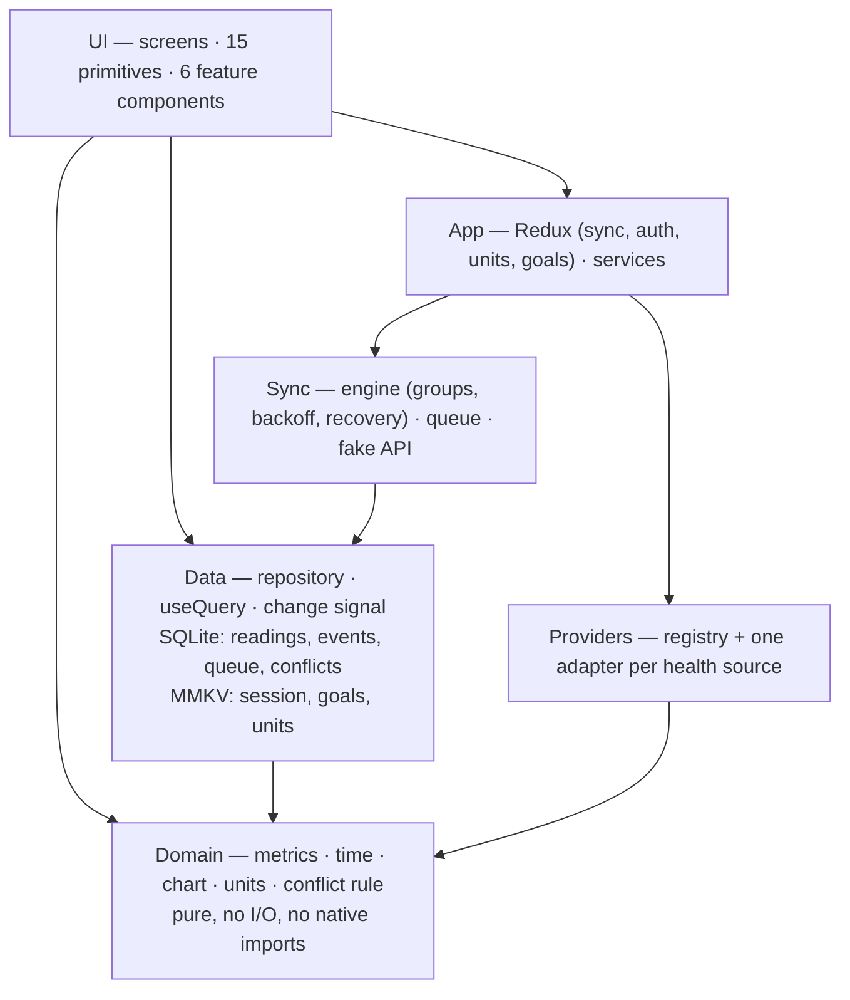

# Baseline — Health Progress Tracker

Track weight, water, sleep, steps and energy over time. Every reading is saved on
the phone first, then uploaded when it can be. Nothing waits for the network, and
nothing is lost if the upload never works.

React Native 0.87.1 · React 19.2.3 · TypeScript · **438 tests in 31 suites**

> **[ARCHITECTURE.md](ARCHITECTURE.md)** goes deeper: schema, query plans,
> measurements, and the reasoning behind each choice.

---

## In plain terms

The app tracks five health numbers and shows whether each is moving the way you
want. Four ideas shaped it:

- **Your phone comes first.** What you type is saved immediately. You never wait
  for the internet, and it all works with no signal.
- **Nothing gets lost.** Unsent readings wait in a queue on the phone. If sending
  fails the app retries; if it keeps failing it says so and keeps the reading.
- **It asks instead of guessing.** If your fitness app and something you typed
  disagree about the same day, it shows both and lets you choose.
- **It never changes what you recorded.** Switching to pounds, or changing a
  goal, only changes how numbers are *shown*.

There is no real server. Uploads go to a fake one that fails about one time in
seven, on purpose. Health-app data is sample data.

---

## Run it

Node ≥ 22.11, Xcode 16+ for iOS, JDK 17 and the Android SDK for Android.

```bash
npm install
bundle exec pod install --project-directory=ios   # iOS only
npm run ios     # or: npm run android
npm test        # 438 tests
```

If Android fails with *"SDK location not found"*, export
`ANDROID_HOME=$HOME/Library/Android/sdk`. Avoid `./gradlew clean` — op-sqlite's
prefab needs two passes to recover from it.

**Sign in** with any of these (they are listed on the sign-in screen and fill in
when tapped):

| Email | Password | Shows |
| --- | --- | --- |
| `vishal@baseline.app` | `baseline` | ~18,000 seeded readings |
| `demo@baseline.app` | `demo1234` | Onboarding, then seeded history |
| `empty@baseline.app` | `empty1234` | Every empty state |

**Worth five minutes:** sign in as `vishal@`, add a weight from History — today
already holds a reading from a scale, so Sync shows a conflict. Then turn on
airplane mode and keep using the app. Delete a row and use the undo. Switch
Settings → Weight → `lb` and watch every screen re-read without a single stored
row changing.

---

## Architecture

Four layers, and the dependency arrow points one way.



The domain layer imports nothing from the others. That is what lets its rules be
tested without a device — the database and storage libraries are native code and
cannot run under Jest.

**Saving a reading writes three things**: the reading, a record of what happened,
and an instruction to upload it. All three save together or none do. If the
reading saved and the upload instruction did not, it would never sync and nothing
on screen could tell. The form closes as soon as the save lands.

---

## Key decisions

- **SQLite, SQL written by hand, no ORM.** Speed here is the indexes and how each
  query runs. Writing the SQL myself means I can read exactly what happens and
  measure it.
- **Redux holds screen state only** — sync status, who is signed in, units,
  goals. Readings live in the database and screens read them from there, so one
  fact has one home and there is no cache to keep in step. A small signal tells
  screens when to re-read, grouped over 50 ms so six syncs cause one reload.
- **Each dashboard card runs its own query.** If one metric is slow or fails,
  that card says so and the rest keeps working.
- **Units are a way of showing a number, not part of it.** Weight is always
  stored in kilograms, water in millilitres, sleep in minutes. Storing the
  converted value would tie it to a setting you can change later.
- **No charting library.** A chart library adds a large drawing engine for what
  is a couple of hundred lines of SVG. The maths behind the chart is a plain
  function with 32 tests.
- **The fake server is a small class, not a library**, so tests can control
  delay, failure rate and lost replies exactly.
- **React Navigation, native stack.** Tabs for the four main screens, a stack
  above for the log sheet, metric view and conflict screen. Which screens exist
  depends on sign-in and onboarding, so the navigator enforces that rather than
  each screen checking.
- **FlashList for history.** It recycles rows instead of keeping them all
  mounted, which is what makes years of readings scrollable.

---

## Where data lives

**SQLite** holds anything that is a measurement: readings, a log of every change,
the upload queue, and open conflicts. It is the one source of truth. **MMKV**
holds settings: session, goals, units, connected sources.

Readings are stored in one fixed unit with the time as a plain number. Changing a
unit or a goal never rewrites a stored row. Screens keep no copy of the data;
they ask the database and re-ask when the signal fires.

---

## Reading from health apps

Health apps describe the same measurement differently, and these three disagree
in three ways at once:

| Source | Field name | Unit | Time |
| --- | --- | --- | --- |
| Apple Health | `body_mass` | kilograms | text date |
| Health Connect | `weight` | **grams** | number |
| Legacy feed | `weight_kg` | **pounds** | seconds |

Each source has a small adapter that turns its shape into one common form. Above
that line, nothing knows where a reading came from.

The legacy feed is why the layer exists: its field is called `weight_kg` but the
values are pounds. Trust the name and you store a believable number that is wrong
by a factor of 2.2, with nothing to flag it. So the adapter reads the unit field
and ignores the name.

A source that fails is reported on its own — one being unavailable does not stop
the others. Unknown measurement types are skipped rather than treated as errors.

Mocking was deliberate. The brief asks that the app work the same whether data is
real or mocked, so the boundary is the point, and three sources that disagree
test it harder than one real source would. One thing a real store would expose:
the provider interface models *available* and *fetch*, but not *installed, and
waiting on the user to grant permission*. Supporting that would mean growing the
interface, not editing an adapter.

---

## Offline and sync

Unsent changes wait in a queue on the phone, split into groups — one per metric
per day. **Order is kept inside a group, not between groups**, so a stuck weight
upload cannot hold up a water change. Three groups send at once, oldest first.

| Concern | How |
| --- | --- |
| Retry | Waits 1s, then 2, 4, 8, 16, 32 |
| Gave up | Stops after 6 tries and says so; the reading is kept |
| Duplicate requests | Each change carries an id made on the phone, so a re-send is recognised and never applied twice |
| Out of order | First in, first out within a group, one at a time |
| Killed mid-send | Anything left in flight is reset at the next launch |
| Session expired | A 401 stops everything and raises the sign-in screen |

Sending is triggered by saving, opening the app, the network returning, and
returning to the foreground. There is no polling.

### Conflicts

Two health apps reporting the same moment merge silently, newest kept. The app
asks only when something *you typed* disagrees with another source.

The brief's example — you record 72.8, the scale reports 72.5, you correct to
72.6, the server had 72.4 — is four events but **three** choices: your 72.8 and
your 72.6 are the same record, so they count once. The app suggests 72.6, your
most recent typed value. Whatever you pick, the rest stay in your history.

Order comes from the server's sequence number. A phone clock never decides,
because two phones offline will both claim a time.

**In a real product I would go further.** Each record would carry a version
number and the server would reject a write based on a stale one, returning the
current row so the phone can resolve it in one round trip. The idempotency key
would live server-side for a window, so a re-send after a crash is recognised.
And the change log would become the source of truth with the current value
derived from it — ordering and history then come for free.

### The fake server

Deliberately awkward, so the app has to cope with a real one: replies take
¼–1½ seconds, about one request in seven fails, some failures are worth retrying
and some are not, and some replies are lost *after* the change was accepted. That
last case is why every change carries its own id. Failures come from a seeded
random generator, so a test fails the same way every run.

---

## When the app is interrupted

| What happens | What the app does |
| --- | --- |
| No network while you save | Saves normally; the upload goes when the network returns |
| Network drops mid-upload | Fails, waits, retries |
| App killed mid-upload | Anything in flight is reset at next launch; re-sending is safe |
| Opened hours later | Reads its own database and shows your data immediately, then syncs behind the scenes |
| Signed in on another device | The server returns 401. Sending stops, a re-auth screen appears, every unsent change is kept and goes out in order afterwards |
| Backgrounded mid-upload | **Safe, but not paused.** The upload continues. Nothing is lost or duplicated, but the app keeps starting work it may not be allowed to finish |

**Pausing on background is the next step.** The engine already stops mid-drain
when a session expires, and pausing would reuse that check. Finishing a request
already in flight is a separate problem needing an OS background task — platform
work, not a design change. The ordering was deliberate: this case is safe, just
wasteful, while the other four could lose data.

---

## What you see when something is wrong

| Situation | What is shown |
| --- | --- |
| First load | Skeletons shaped like the content, not a spinner |
| A metric fails | That card says so and offers a retry; the others keep working |
| Nothing recorded yet | An explanation and a button to add the first reading |
| Nothing in the range picked | Says the readings are older and suggests a longer range |
| Upload failed | The row says so with a retry; after six tries it stops and says so |
| Only some data arrived | Each card is stamped with when it was last read |
| A health app unavailable | Named on its own, next to what the others returned |

Readings imported from a health app show where they came from, rather than a sync
state they will never reach.

---

## Testing

**438 tests in 31 suites**, over ~8,400 lines. The aim is to test where a mistake
gives a believable wrong answer rather than a crash. A crash is easy to spot; a
wrong number is not. Covered: metric and goal calculations, unit conversion,
provider normalisation, the offline queue and its ordering, conflict resolution,
retry and recovery, and safe re-sending.

Several tests exist because the mistake was actually made:

- Time zones are **added** to a timestamp, not subtracted. Backwards still gives
  a date that looks fine.
- Weight shows the day's **last** reading, not the average — averaging 66.1 and
  77.5 gives 71.8, a number never on the scale.
- Two readings saved in the same minute share a timestamp, so something has to
  break the tie or the dashboard picks at random.
- The metric screen converts **once**. In kilograms a double conversion is
  invisible, so those tests are written in pounds.

Not covered: tapping through whole screens, and two things the test library
cannot observe (FlashList's configuration, and a one-frame flash between list
loads). Both are noted in the test files and verified on a device instead.

---

## Performance

Measured with **~18,000 readings over 1,300 days** on a real phone.

| Query | Time |
| --- | --- |
| 7-day range | 0.05 ms |
| 3-month range | 0.55 ms |
| 3-month chart | 0.30 ms |

Every query uses an index; none scan the table. Checking that found two missing
indexes. Lists page by remembering the last row seen rather than counting from
the start, so scrolling deep costs the same as scrolling shallow. Charts are
summarised by the database, not the app, and reduced to at most 60 points. Cards
and rows are memoised, and their callbacks kept stable, so one card resolving
does not re-render the others.

**The long list is a measured trade, not a solved problem.** Rendering is
synchronous, so a tab pressed during it waits. The first commit was 570 ms and is
now ~360 ms, after shrinking the first page, telling the list that headers and
rows differ, stabilising callbacks and building row icons once. Rendering further
ahead means fewer blank cells when flinging but a longer commit; it is tuned
toward responsiveness, because an unresponsive tab is the worse failure.

**At larger scale** I would summarise readings older than a year into daily
rollups. Not done here: the widest range offered is three months, which measures
at 0.30 ms, so it would solve a problem the numbers say does not exist.

---

## Trade-offs and limits

- **Splitting the queue into groups** costs about 1.5× a single queue, and buys
  the guarantee that one stuck upload cannot hold up unrelated changes.
- **Imported readings are never uploaded.** They stay on the phone that imported
  them. The row shows the source rather than pretending it synced.
- **Conflicts are only found on the phone.** Code for a server-reported one
  exists but nothing calls it.
- **The app only sends, never fetches.** A change made on another device will not
  appear.
- **Date and time are typed into text boxes**, so readings are recorded to the
  minute — hence the tiebreak above.
- **History can show blank cells under a very fast fling**, per the trade above.
- **Soft delete everywhere**, so the database only grows; production needs a
  compaction policy.
- Light theme only. Sign-in is a local check, not a real token.

---

## What is built, and what is not

**Built.** Dashboard with five metrics, goal ring, 7-day / 30-day / 3-month
views · add, edit and delete with confirmation and undo · history with date and
time · importing from three sources · changeable units (kg/lb, ml/L, min/hr) ·
editable goals · offline writes · a queue that retries, gives up cleanly and
survives being killed · conflict detection and resolution · sign-in, sign-out and
session expiry · loading, empty, error and partial states · 438 tests.

**Partly built.** Four of the five lifecycle cases (see above). Conflicts found
on the phone only. Settings shows storage size but cannot manage it.

**Designed, not built.** Server-settled conflicts with a version per record;
fetching changes as well as sending; rollups for data older than a year.

**Next, in order.** Server-side conflict handling; fetching as well as sending;
tests that walk save-then-sync and conflict-then-resolve as a user would.

**Assumptions.** One person per phone, so signing out clears the data. A day
means a local day everywhere. What you typed outranks what was imported when
someone must choose. The demo history is realistic, but nothing depends on it.

---

## AI usage

Built with AI assistance (Claude). I decided what to build and how it should
work; the AI wrote the code step by step, and I reviewed each step.

**What I decided.** The idea and requirements — I gave the AI the brief, it
returned a first design, and we went through several rounds before I settled it.
The libraries, UI primitives and components, approved as a list before anything
was built. The folder structure. The data layer — tables, and how readings are
written and read. How syncing works — one queue split by metric and day, order
kept inside a group, retries with a growing wait, and what happens when sending
keeps failing. The screens and what each depends on.

**What the AI did.** Implemented each of those with tests, one piece at a time.
It was fast and accurate at that, and useful for breadth: the UI primitives, the
three adapters, most of the test scaffolding.

**Suggestions it made that I kept.** Storing timestamps as plain numbers so the
index keeps working. A separate append-only log of every change. Keeping open
conflicts in their own table instead of recalculating them. Splitting risky SQL
into files of its own so it can be tested. It also found two missing indexes by
checking how the queries actually run.

**Where I corrected it.** Its first sync design was a single queue for
everything; splitting it by metric and day was mine. It put that split at two to
three times the work; I checked, and it was about 1.5×. Its first data layer was
over-built at ~1,800 lines with query builders for screens that did not exist; I
had it cut to ~870. Its conflict rule would have asked me to choose between two
readings I had typed myself, which is not a conflict.

**Testing and bugs.** I ran the app on a real phone throughout and reported what
I found. Almost every late bug came from that, not the test suite: readings stuck
on "Pending" because the sync engine was never started; onboarding repeating on
every launch; the dashboard reading a database that was not open yet; a list
going blank when scrolled fast. Each one I reported, the AI fixed, and a test now
covers it.

**The pattern worth naming.** The AI was good at building pieces and testing
them, and poor at joining them together. Nearly every late bug was wiring: a
piece worked alone, but nothing called it, or called it in the wrong order.
Running the app on a real phone found what a passing test suite could not.
